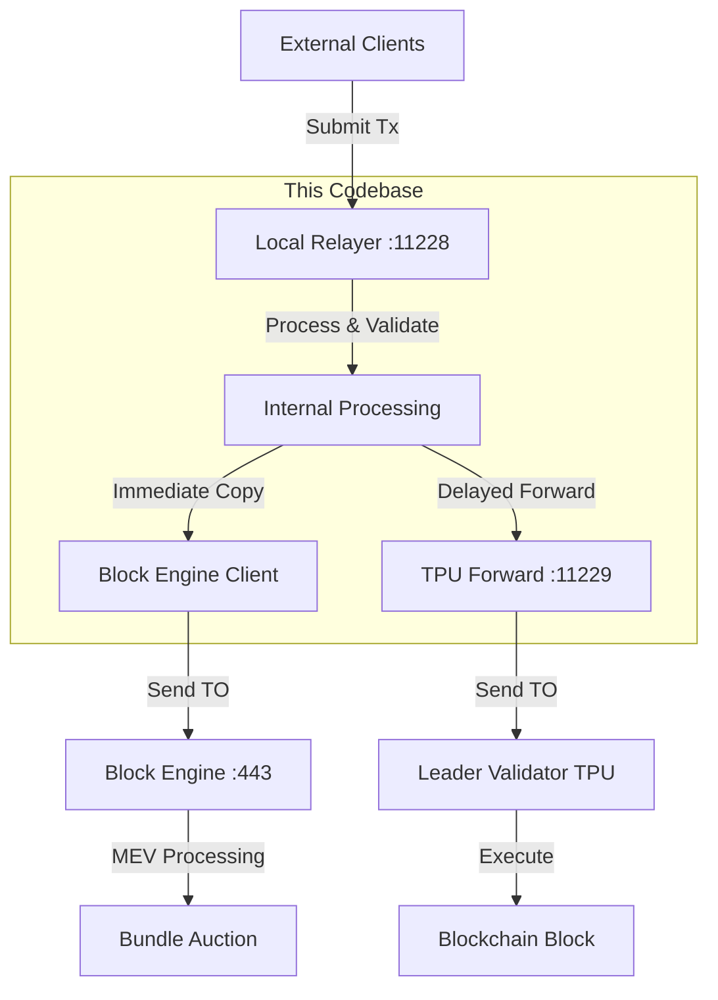

# Jito Relayer

⚡ **High-Performance TPU Proxy for Solana Validators**

**Version**: 2.1  
**Target Audience**: Validators, Infrastructure Engineers

---

## 📖 **Table of Contents**

1. [Project Overview](#project-overview)
2. [Workspace Architecture](#workspace-architecture) 
3. [Transaction Flow](#transaction-flow)
4. [Port Configuration](#port-configuration)
5. [Development Guide](#development-guide)
6. [Authentication](#authentication)
7. [Troubleshooting](#troubleshooting)

---

## 🎯 **Project Overview**

Jito Relayer is a Rust-based TPU (Transaction Processing Unit) proxy for Solana validators. Each validator runs their own instance to participate in MEV infrastructure while providing high-performance transaction forwarding.

### **Core Capabilities**
- **QUIC-based TPU Proxy**: Ultra-low latency transaction processing
- **MEV Integration**: Direct connection to Block Engine for MEV bundle processing
- **Authentication Services**: JWT-based validator authentication
- **Leader Schedule Management**: Optimal transaction routing to current leaders
- **Health Monitoring**: Built-in diagnostics and metrics

### **Who Runs This**
- **Individual Validators**: Each validator operates their own relayer instance
- **Purpose**: Enable MEV participation and provide TPU proxy services
- **Infrastructure**: Connects validator to broader Jito MEV ecosystem

## 🏗️ **Workspace Architecture**

### **Package Structure**
```
jito-relayer/
├── block_engine/          # Block Engine client integration
├── core/                  # Core Solana functionality (no validator deps)
├── jito-protos/          # gRPC protocol buffer definitions
├── relayer/              # Authentication, health, TPU proxy logic
├── rpc/                  # RPC load balancing
├── transaction-relayer/  # Main binary and orchestration
├── web/                  # Web server diagnostics
└── packet_blaster/       # Performance testing tool
```

### **Component Responsibilities**

#### **1. transaction-relayer/** (Main Binary)
- **Orchestration**: Coordinates all services and components
- **CLI Configuration**: 40+ command-line options for deployment
- **Service Management**: Manages TPU, authentication, and web services
- **Signal Handling**: Graceful shutdown and health monitoring

#### **2. block_engine/** (MEV Integration)
- **Block Engine Client**: Direct gRPC connection to Jito Block Engine
- **Packet Forwarding**: Sends transaction copies for MEV processing
- **Authentication**: JWT-based auth with Block Engine services
- **AOI/POI Filtering**: Accounts/Programs of Interest filtering

#### **3. relayer/** (Core Proxy Logic)
- **TPU Proxy**: QUIC-based transaction forwarding to validators
- **Authentication Service**: Ed25519 challenge-response authentication
- **Leader Schedule**: Caches current and future slot leaders
- **Health Management**: Tracks system health via slot monitoring

#### **4. core/** (Solana Integration)
- **TPU Implementation**: QUIC server management and packet processing
- **OFAC Filtering**: Compliance filtering for sanctioned addresses
- **Solana Types**: Core blockchain functionality without validator dependencies

#### **5. jito-protos/** (Protocol Definitions)
- **gRPC Services**: Auth and Relayer service definitions
- **Message Types**: Protocol buffer schemas for communication
- **Client Generation**: Generated clients for service interaction

### **Key Dependencies**
- **Solana v2.1.16**: Core blockchain functionality
- **QUIC (quinn)**: High-performance networking
- **gRPC (tonic)**: Service communication
- **JWT**: Authentication tokens
- **Ed25519**: Cryptographic signatures

## 🔄 **Transaction Flow**

### **Dual-Path Architecture**

This relayer implements a sophisticated dual-path system for transaction processing:



### **Transaction Processing Steps**

1. **Reception** (Port 11228): Receive transactions from clients via QUIC
2. **Dual Forwarding** (`transaction-relayer/src/forwarder.rs`):
   - **Immediate**: Send copy TO Block Engine for MEV processing
   - **Delayed**: Buffer and forward TO validators after configured delay
3. **Leader Routing**: Forward to current slot leader based on schedule
4. **Execution**: Leader validator processes and includes in blocks

### **Code Flow (forwarder.rs)**

```rust
// Immediate Block Engine forwarding (line 82)
block_engine_sender.try_send(BlockEnginePackets {
    banking_packet_batch: banking_packet_batch.clone(),
    stamp: system_time,
    expiration: packet_delay_ms,
})

// Delayed validator forwarding (line 103)
buffered_packet_batches.push_back(RelayerPacketBatches {
    stamp: instant,
    banking_packet_batch,
});
```

### **MEV Ecosystem Integration**

- **Local Relayer Role**: Acts as transaction hub feeding data to Block Engine
- **Block Engine Processing**: MEV auctions, bundle simulation, compliance filtering
- **Bundle Distribution**: Block Engine returns optimized bundles via separate infrastructure
- **Revenue Sharing**: MEV rewards flow to validators and stakers

## ⚙️ **Port Configuration**

### **Main Application Ports**

| Port | Protocol | Service | Purpose |
|------|----------|---------|---------|
| **11226** | TCP/gRPC | Authentication Server | Validator authentication & API |
| **11227** | HTTP | Web Diagnostics | Health checks & metrics |
| **11228** | QUIC/UDP | TPU Reception | Transaction reception from clients |
| **11229** | QUIC/UDP | TPU Forward | Transaction forwarding to validators |

### **Port Usage Details**

#### **Port 11226 (gRPC Authentication)**
- **Purpose**: Validator authentication and service coordination
- **Authentication**: Ed25519 challenge-response + JWT tokens
- **Access Control**: Only validators in leader schedule or allowlist
- **Rate Limiting**: 1 request/second per IP by default

#### **Port 11228 (TPU Reception)**
- **Purpose**: High-performance transaction reception
- **Protocol**: QUIC for ultra-low latency
- **Access**: Authenticated clients only (via JWT from 11226)
- **Processing**: Immediate validation and dual-path forwarding

#### **Port 11229 (TPU Forward)**
- **Purpose**: Internal transaction forwarding to validators
- **Target**: Current slot leader's TPU endpoints
- **Optimization**: Direct validator TPU access bypassing RPC

#### **Port 11227 (Diagnostics)**
- **Health Check**: `curl http://localhost:11227/health`
- **Status**: `curl http://localhost:11227/status`
- **Metrics**: Performance and operational metrics

### **External Connections**

| Port | Service | Purpose |
|------|---------|---------|
| **8899** | Solana RPC | Blockchain state queries, leader schedule |
| **8900** | Solana WebSocket | Real-time slot updates and events |
| **443** | Block Engine | MEV processing and bundle submission |

## 🛠️ **Development Guide**

### **Prerequisites**
- **Rust**: Nightly 2024-09-05 (specified in `rust-toolchain.toml`)
- **System**: Linux (Ubuntu 20.04+) or macOS
- **Memory**: 16GB+ RAM recommended
- **Network**: Stable connection to Solana RPC endpoints

### **Setup**
```bash
# Clone and initialize
git clone https://github.com/jito-foundation/jito-relayer.git
cd jito-relayer
git submodule update --init --recursive

# macOS OpenSSL setup
export OPENSSL_DIR=$(brew --prefix openssl)
export PKG_CONFIG_PATH="$OPENSSL_DIR/lib/pkgconfig:$PKG_CONFIG_PATH"

# Build
cargo build --release
```

### **Configuration**

#### **1. Generate Keys**
```bash
# Validator identity keypair
solana-keygen new --no-bip39-passphrase --outfile keypair.json

# Authentication keys
openssl genpkey -algorithm Ed25519 -out signing_key.pem
openssl pkey -in signing_key.pem -pubout -out verifying_key.pem
```

#### **2. Run Relayer**
```bash
# Basic configuration
cargo run --bin jito-transaction-relayer -- \
    --keypair-path keypair.json \
    --signing-key-pem-path signing_key.pem \
    --verifying-key-pem-path verifying_key.pem

# Production with MEV integration
cargo run --bin jito-transaction-relayer -- \
    --keypair-path keypair.json \
    --signing-key-pem-path signing_key.pem \
    --verifying-key-pem-path verifying_key.pem \
    --rpc-servers https://api.mainnet-beta.solana.com \
    --websocket-servers wss://api.mainnet-beta.solana.com \
    --block-engine-url https://amsterdam.mainnet.block-engine.jito.wtf \
    --packet-delay-ms 200
```

### **Testing**
```bash
# Unit tests
RUST_LOG=info cargo test

# Load testing
cargo run --bin packet-blaster -- \
    --tpu-addr 127.0.0.1:11228 \
    --num-clients 10 \
    --packets-per-client 1000
```

### **Code Quality**
```bash
# Clippy (requires nightly)
cargo +nightly-2024-09-05-x86_64-unknown-linux-gnu clippy --all-targets

# Format
cargo fmt

# Check dependencies
cargo +nightly-2024-09-05-x86_64-unknown-linux-gnu udeps --locked
```

## 🔐 **Authentication**

### **Validator Authentication Flow**

#### **Step 1: Generate Challenge**
```bash
grpcurl -plaintext -d '{
  "role": "VALIDATOR",
  "pubkey": "YOUR_32_BYTE_PUBKEY_BASE64"
}' localhost:11226 auth.AuthService/GenerateAuthChallenge
```

#### **Step 2: Sign Challenge**
```bash
grpcurl -plaintext -d '{
  "challenge": "CHALLENGE_TOKEN",
  "client_pubkey": "YOUR_32_BYTE_PUBKEY",
  "signed_challenge": "ED25519_SIGNATURE_64_BYTES"
}' localhost:11226 auth.AuthService/GenerateAuthTokens
```

#### **Step 3: Use JWT Token**
```bash
grpcurl -plaintext -H "authorization: Bearer JWT_TOKEN" -d '{
  "packets": [{"data": "SERIALIZED_TRANSACTION_BASE64"}]
}' localhost:11226 relayer.RelayerService/SendPackets
```

### **Authorization Modes**

#### **Mode 1: Leader Schedule (Default)**
- Only validators currently scheduled as leaders can authenticate
- Automatically updates from Solana RPC every 10 seconds
- No manual configuration required

#### **Mode 2: Explicit Allowlist**
```bash
--allowed-validators pubkey1,pubkey2,pubkey3
```

### **Security Features**
- **Ed25519 Signatures**: Cryptographic authentication
- **JWT Tokens**: Time-limited access tokens
- **Rate Limiting**: DOS protection
- **Challenge-Response**: Prevents replay attacks

## 🚨 **Troubleshooting**

### **Common Issues**

| Error | Cause | Solution |
|-------|-------|----------|
| `Connection refused (11226)` | Relayer not running | Start relayer service |
| `Permission denied` | Pubkey not authorized | Add to allowlist or check leader schedule |
| `Connection refused (8899)` | No Solana RPC | Configure valid RPC endpoint |
| `Invalid signature` | Auth failure | Verify Ed25519 keypair and signing |

### **Health Monitoring**
```bash
# Service health
curl http://localhost:11227/health

# Detailed status
curl http://localhost:11227/status

# Check logs
journalctl -u jito-relayer --follow
```

### **Performance Tuning**
```bash
# Increase TPU servers for higher throughput
--num-tpu-quic-servers 8
--num-tpu-fwd-quic-servers 4

# Optimize packet batching
--validator-packet-batch-size 8

# Memory optimization
export MALLOC_CONF="dirty_decay_ms:1000,muzzy_decay_ms:1000"
```

### **Network Configuration**
```bash
# Required firewall rules
ufw allow 11226/tcp  # gRPC authentication
ufw allow 11227/tcp  # Web diagnostics
ufw allow 11228/udp  # TPU reception
ufw allow 11229/udp  # TPU forwarding
```

## 📊 **Quick Reference**

### **Essential Commands**
```bash
# Run relayer
cargo run --bin jito-transaction-relayer -- --keypair-path keypair.json

# Health check
curl http://localhost:11227/health

# Test authentication
grpcurl -plaintext localhost:11226 auth.AuthService/GenerateAuthChallenge
```

### **Key Files**
- `transaction-relayer/src/main.rs`: Main orchestration
- `transaction-relayer/src/forwarder.rs`: Dual-path transaction forwarding
- `relayer/src/relayer.rs`: TPU proxy and authentication
- `block_engine/src/block_engine.rs`: Block Engine client

### **Important Ports**
- **11226**: Validator authentication (gRPC)
- **11228**: Transaction reception (QUIC)
- **11229**: Transaction forwarding (QUIC)
- **11227**: Health monitoring (HTTP)

---

*Jito Relayer v2.1 - Open-source TPU proxy for Solana validators*